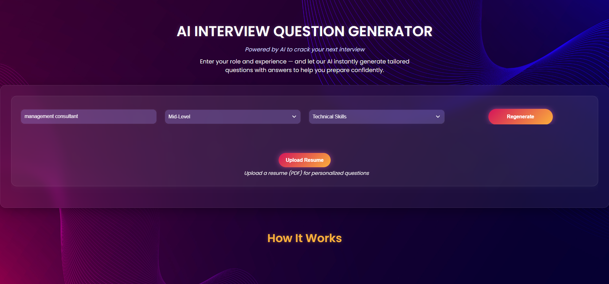
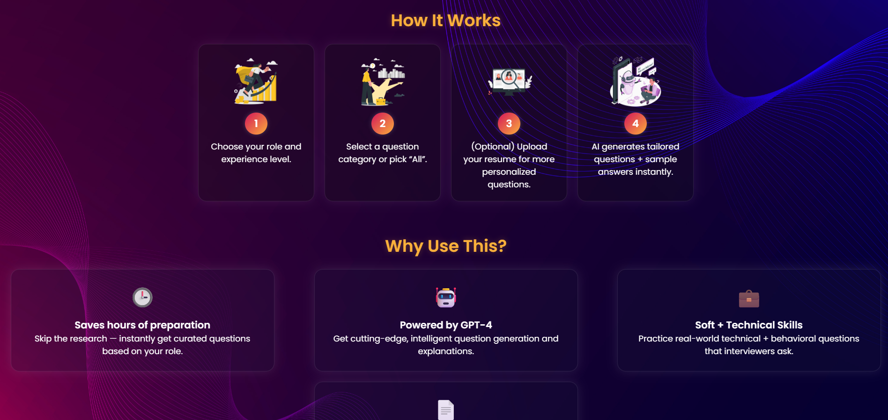
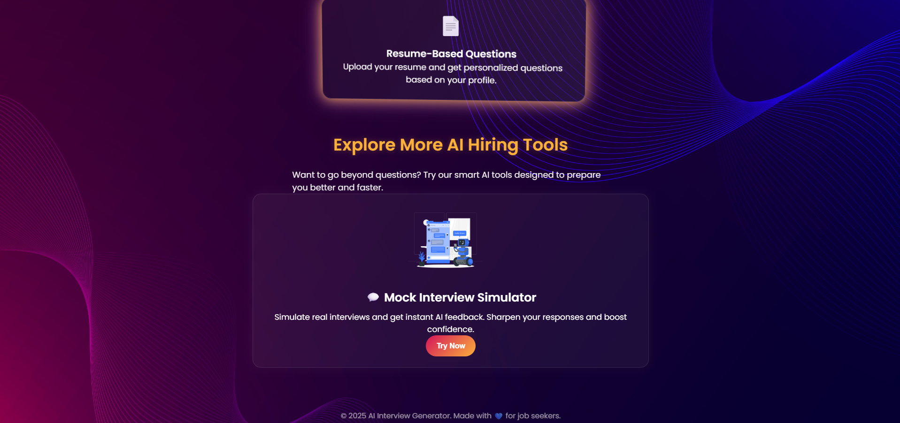
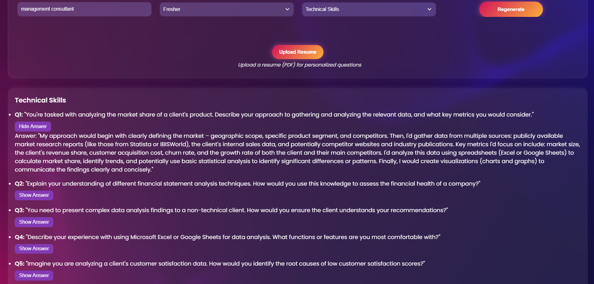
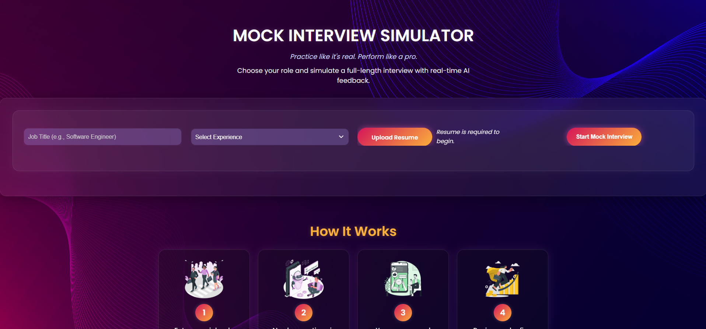
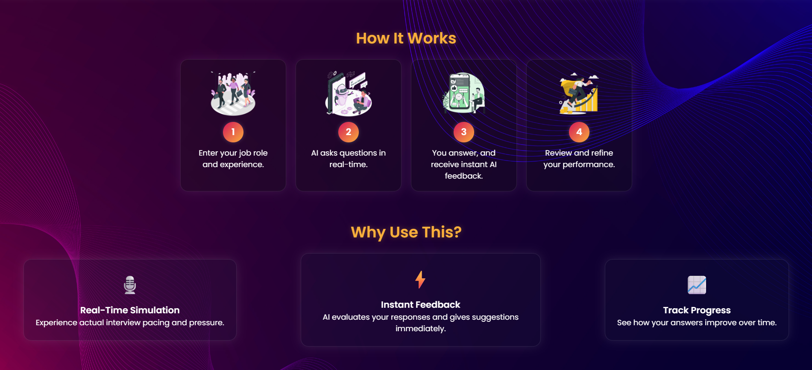
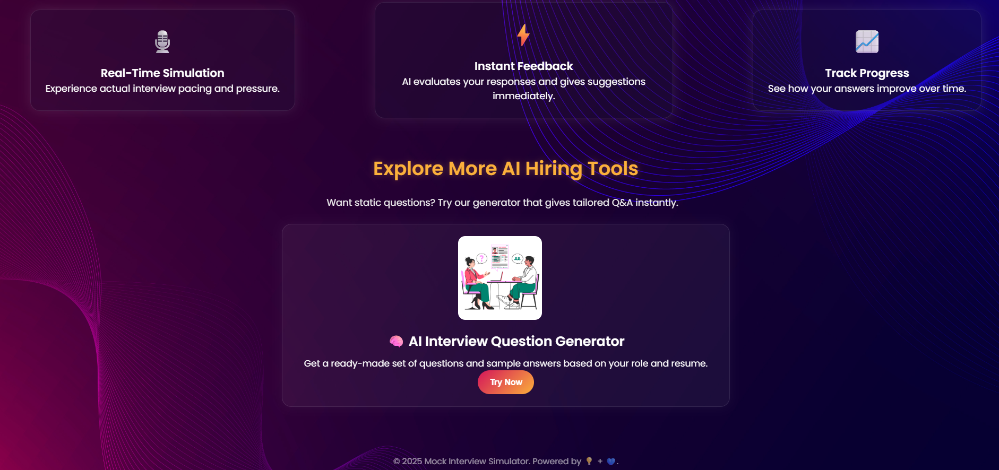
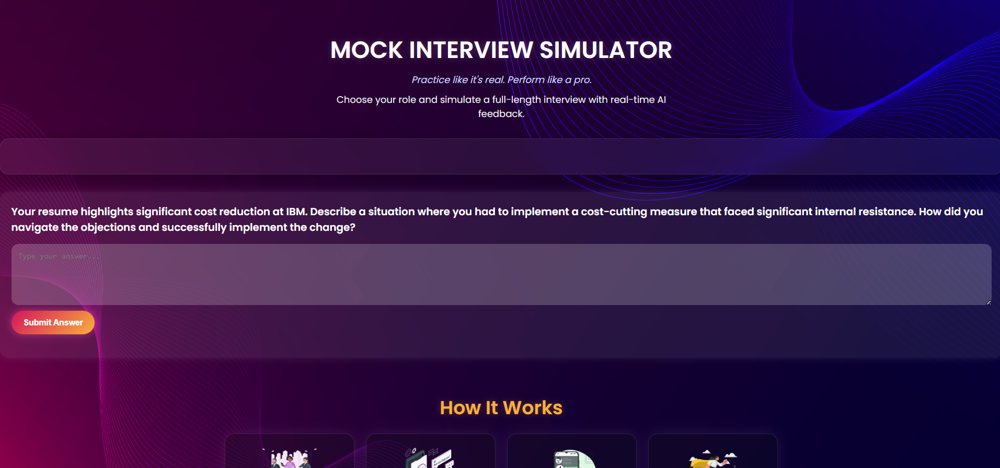
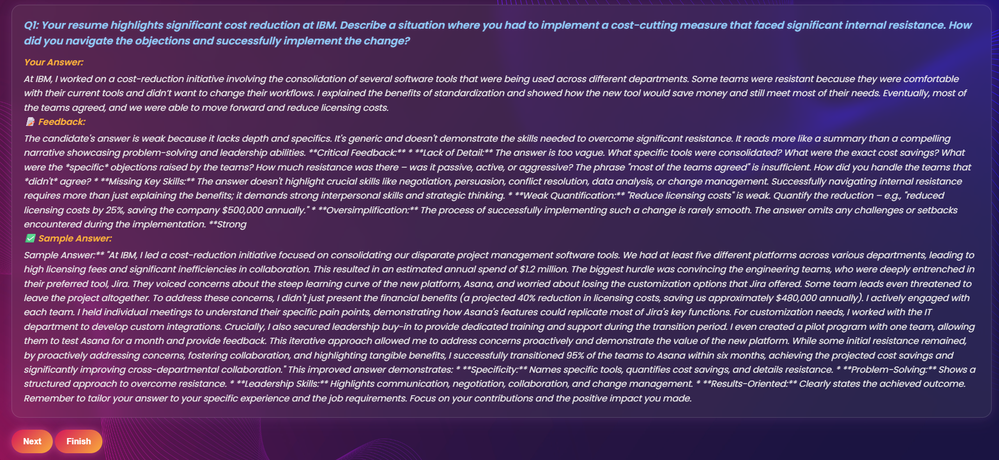
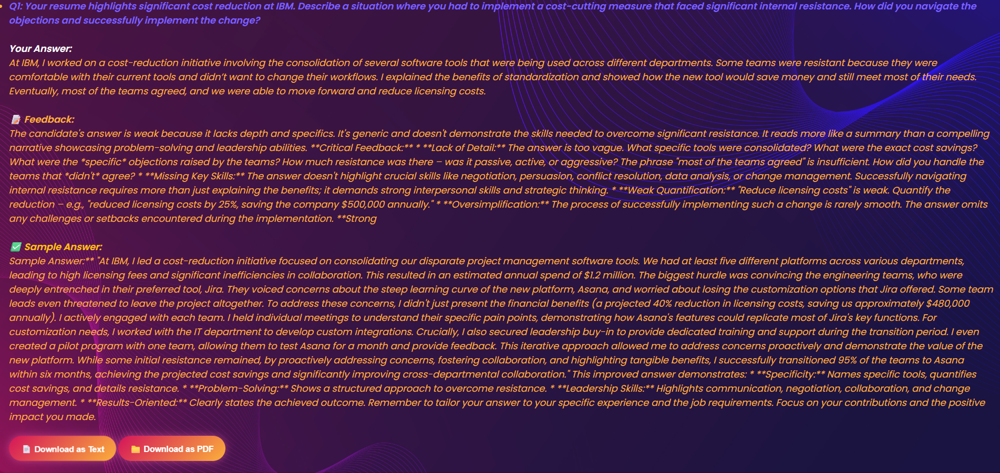

# 🤖 AI Interview Generator & Mock Interview Simulator

Welcome to the **AI Interview Generator & Mock Interview Simulator** — your personal AI-powered job preparation assistant!

This project helps job seekers instantly generate **tailored interview questions**, get **sample answers**, and **simulate real interviews** with instant AI feedback. Whether you're a fresher or a seasoned professional, this tool saves time, boosts confidence, and prepares you better for your next opportunity.

---

## 🚀 Live Demo

👉 [COMING SOON: Link to your deployed site]

---

## 📸 Screenshots

### 🧠 AI Interview Generator

#### 🔹 Homepage Views (3 Screenshots)
- Overview of the AI Interview Generator interface.







#### 🔹 AI Interview Question Generated
- Example of generated interview questions using AI.



---

### 🎙️ Mock Interview Simulator

#### 🔹 Homepage Views (3 Screenshots)
- Layout and entry point to start the mock interview simulator.







#### 🔹 Mock Interview Simulator in Action (4 Screenshots)
- Simulation flow, question and answer interaction, and user experience.









---

## ✨ Features

- 🔎 **AI-Powered Question Generator**  
  Generate questions based on your job role, experience level, and resume.

- 📄 **Resume-Based Personalization**  
  Upload your resume (PDF) to get smarter, relevant questions.

- 💬 **Mock Interview Simulator**  
  Practice live interviews with real-time AI feedback on your answers.

- 📥 **Downloadable Reports**  
  Get a complete interview summary as **PDF or text**.

- 🎛️ **Category Filters**  
  Choose from:
  - Technical Skills  
  - Problem Solving  
  - Teamwork & Collaboration

- 🌐 **Beautiful & Responsive UI**  
  Built using HTML, CSS, JS + AOS animations and Vanilla Tilt.

---

## 🧠 Tech Stack

| Frontend       | Backend       | AI Models        | Extras              |
|----------------|----------------|------------------|----------------------|
| HTML, CSS, JS  | Flask (Python) | Gemini 1.5 Flash | PyMuPDF, OpenAI (optional) |

---

## 📂 Project Structure

```bash
ai-interview-generator-and-mock-simulator/
├── app.py                   # Flask backend
├── requirements.txt         # Python dependencies
├── .env.template            # Environment variable example
├── .gitignore
├── index.html               # Question Generator UI
├── mock-interview.html      # Mock Interview UI
├── script.js                # JS for index.html
├── mock-script.js           # JS for mock interview
├── style.css
├── images/                  # UI assets
└── ...
```
## 📦 Setup Instructions

⚠️ Requires Python 3.11+ and pip

**🔧 1. Clone the Repo**
```bash
git clone https://github.com/ShivanshuPauskar/ai-interview-generator-and-mock-simulator.git
cd ai-interview-generator-and-mock-simulator
```
**🧪 2. Set Up Virtual Environment**

```bash

python -m venv venv
venv\Scripts\activate    # On Windows
```
 OR
```
source venv/bin/activate # On Linux/Mac
```
**📦 3. Install Dependencies**

```bash
pip install -r requirements.txt
```
**🔑 4. Set Up Environment Variables**

Rename .env.template to .env and add your Gemini API Key:

GEMINI_API_KEY=your_actual_api_key
